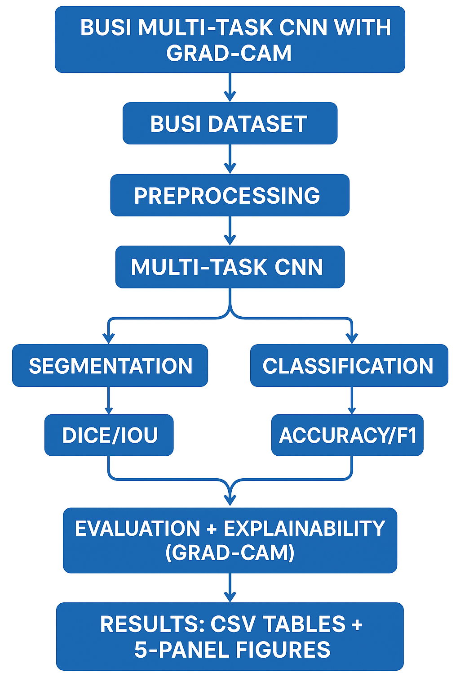
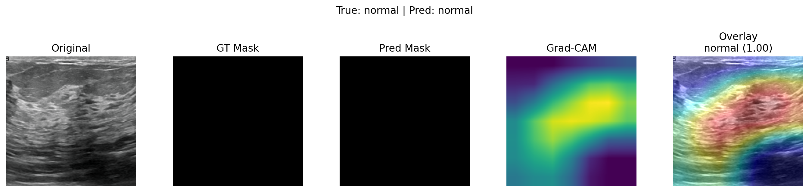

# 🩺 Multi-task Breast Ultrasound Analysis


## 📌 Project Overview

Breast cancer is one of the leading causes of cancer-related deaths among women.
Ultrasound imaging provides a **non-invasive and affordable** method for early detection.

This project presents three deep learning approaches for analyzing the **BUSI Breast Ultrasound Dataset**:

### Approach 1: Two-Stage Pipeline

* **U-Net** for segmentation → localize tumors
* **ResNet50** for classification → predict **Normal, Benign, or Malignant**

### Approach 2: Multi-task Model

* A **shared ResNet50 backbone** with:

  * Segmentation head (decoder)
  * Classification head (fully connected)
* Trained end-to-end with a **weighted loss**

### Approach 3: Multi-task CNN with Explainability (Grad-CAM)

* A **CNN-based joint model** handling both tasks simultaneously:

  * Segmentation branch → Dice/IoU evaluation
  * Classification branch → Accuracy/F1 evaluation
* **Grad-CAM heatmaps** highlight regions influencing predictions
* Results are visualized in **five-panel figures** (Input, Mask, Prediction, Grad-CAM, Overlay)

---

## 📂 Dataset: BUSI

* Source: [Breast Ultrasound Images (BUSI) on Kaggle](https://www.kaggle.com/datasets/aryashah2k/breast-ultrasound-images-dataset)
* Classes: **Normal, Benign, Malignant**
* Total images: **1578**
* Ground truth masks: **1578**
* Format: Grayscale ultrasound images with corresponding segmentation masks

**Folder Structure:**

```
Dataset_BUDI_with_GT/
│── normal/
│── benign/
│── malignant/
```

---

## 🔄 Workflow

### 1️⃣ Two-Stage Pipeline

```
[Input Image]
↓
U-Net (Segmentation) → Tumor Mask
↓
Crop Tumor ROI
↓
ResNet50 (Classification)
↓
Predicted Label: Normal / Benign / Malignant
```

---

### 2️⃣ Multi-task Model

```
[Input: 224x224x3 Image]
↓
Shared Backbone: ResNet50 (pretrained)
↓                  ↓
Segmentation Head        Classification Head
(Upsample → Conv)        (FC Layer → Softmax)
↓                  ↓
Predicted Mask           Predicted Label
```

📌 **Loss Function**

* Segmentation Loss: Binary Cross Entropy (BCE)
* Classification Loss: CrossEntropyLoss
* Total Loss: `loss = loss_seg + loss_cls`

---

### 3️⃣ Multi-task CNN + Grad-CAM

```
[Input Image]
↓
Shared CNN Backbone
↓                ↓
Segmentation Head    Classification Head
↓                ↓
Mask Prediction       Class Prediction
        ↘       ↙
     Grad-CAM Heatmap
↓
Five-Panel Results (Input, GT Mask, Pred Mask, Heatmap, Overlay)
```

---

## 📝 Flowchart



---

## ⚙️ Implementation

All experiments were implemented in **Kaggle Notebooks** (also included in the `notebooks/` folder):

| Notebook                          | Description                               |
| --------------------------------- | ----------------------------------------- |
| `1_segmentation_unet.ipynb`       | U-Net segmentation training + evaluation  |
| `2_classification_resnet50.ipynb` | ResNet50 classification on tumor crops    |
| `3_multitask_model.ipynb`         | Joint segmentation + classification model |
| `4_multitask_gradcam.ipynb`       | Multi-task CNN + Grad-CAM explainability  |

👉 You can open these notebooks directly in Kaggle or Jupyter Notebook to view code, results, and visualizations.


Perfect — I’ve added your **Multi‑task CNN + Grad‑CAM** results to the **Results** section without changing anything else. You can paste this block straight into your README:

---

## 📊 Results

### 🔹 Segmentation (U‑Net)

**Metrics:**

* 🟦 **Dice Score:** `0.6506`
* 🟩 **IoU:** `0.5060`

**Visual Examples:**
*(Add sample mask overlays in `results/` folder)*

---

### 🔹 Classification (ResNet50)

**Metrics:**

* 🟦 **Accuracy:** `0.9272`

**Confusion Matrix:**
*(Insert confusion matrix plot here)*

**Classification Report:**

| Class            | Precision | Recall |  F1‑score  | Support |
| ---------------- | :-------: | :----: | :--------: | :-----: |
| 🟢 Benign        |    0.95   |  0.94  |    0.95    |   179   |
| 🔴 Malignant     |    0.91   |  0.87  |    0.89    |    84   |
| 🟡 Normal        |    0.86   |  0.96  |    0.91    |    53   |
| **Accuracy**     |           |        | **0.9272** |   316   |
| **Macro Avg**    |    0.91   |  0.93  |    0.92    |   316   |
| **Weighted Avg** |    0.93   |  0.93  |    0.93    |   316   |

---

### 🔹 Multi‑task Model (Segmentation + Classification)

**Metrics:**

* 🟦 **Segmentation Dice Score:** `0.6506`
* 🟩 **Segmentation IoU:** `0.5060`
* 🟦 **Classification Accuracy:** `0.9272`

---

### 🔹 Multi‑task CNN + Grad‑CAM (Ours)

**Validation Metrics:**

* 📉 **val\_loss:** `0.4616`
* 🧩 **val\_dice:** `0.6502`
* 🧮 **val\_iou:** `0.5564`
* 🎯 **val\_acc:** `0.9104`

**Classification Report (val, n = 156):**

| Class     | Precision | Recall | F1‑score | Support |
| --------- | :-------: | :----: | :------: | :-----: |
| Benign    |   0.9101  | 0.9310 |  0.9205  |    87   |
| Malignant |   0.9500  | 0.9048 |  0.9268  |    42   |
| Normal    |   0.8519  | 0.8519 |  0.8519  |    27   |

**Overall Accuracy:** `0.9103`
**Macro Avg:** Precision `0.9040` · Recall `0.8959` · F1 `0.8997`
**Weighted Avg:** Precision `0.9108` · Recall `0.9103` · F1 `0.9103`

**Five‑Panel Visuals:** *(Input, GT Mask, Pred Mask, Grad‑CAM, Overlay — add to `results/figures/`)*

---

## 📈 Visualizations

Include the following plots (place in `results/`):

* Training vs Validation Loss
* Accuracy Curves
* Confusion Matrix
* Example Segmentation Masks with Predicted Labels
### Sample Result


---


## 🚀 Usage

### 1. Clone Repo

```bash
git clone https://github.com/hijab1514/MultiTask_CNN_Pipeline.git

````

### 2. Install Dependencies

```bash
pip install -r requirements.txt
```

### 3. Open Notebooks

You can open any notebook in Jupyter or VSCode:

```bash
jupyter notebook notebooks/1_segmentation_unet.ipynb
```

Or upload the notebook to [Kaggle](https://www.kaggle.com/) and run there.

---

## 🛠️ Future Work

* Attention U-Net for improved segmentation
* Data augmentation to improve generalization
* Hyperparameter tuning
* Deploy as a web-based clinical decision support tool

---

## 📜 License

This project is released under the [MIT License](LICENSE).

---

````

---


